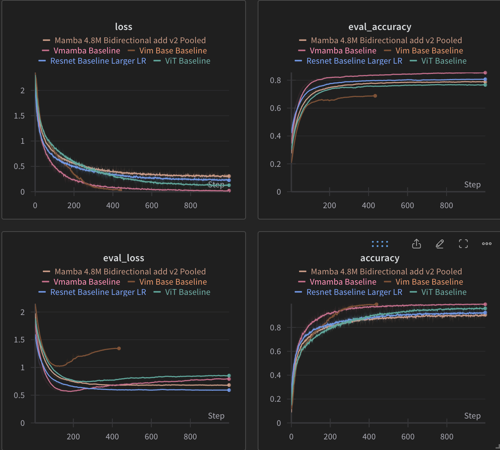

Exploring the use of [Mamba](https://github.com/state-spaces/mamba/tree/main) for Image Classification on CIFAR10
This repository provides implementations of various models for image classification on CIFAR10 using Mamba. The models are trained using the CIFAR10 dataset and the performance is evaluated on the test set. 

The models implemented are:
- VIT [arxiv](https://arxiv.org/abs/2010.11929)
- ResNet [arxiv](https://arxiv.org/abs/1512.03385)
- Vim [arxiv](https://arxiv.org/abs/2401.09417)
- VMamba [arxiv](https://arxiv.org/abs/2401.10166)
- **Mamba** [arxiv](https://arxiv.org/abs/2312.00752)

## Results

Wandb logs are shown above.
| Model                                            | Final Accuracy      |
|--------------------------------------------------|---------------------|
| VMamba Baseline                                  | 0.8542797099150917  |
| Resnet Baseline Larger LR                        | 0.8069028676482759  |
| Mamba (4.8M Bidirectional add v2 Pooled)         | 0.7873412802273614  |
| ViT Baseline                                     | 0.7665795822699559  |

Each model tested is roughly 4.5 - 5M parameters and trained for 200 epochs. 

The results validate what we already know about CNNs vs ViTs on smaller datasets and easier tasks. It is impressive that the base implementation of VisionMamba is able to outperform the ViT baseline. In my opinion, this indicates that the sequence modelling really does work with images and SSMs might come in useful since they are more efficient at higher resolutions. 

In parallel with this work, VMamba and Vim were released. Of these 2 VMamba seems extremely promising and I suspect the reason is due to a more comprehensive scan of 4 directions. 

## Future Work
Because of the promising results of VMamba and to test the hypothesis that the 4 direction scan is the reason for the improved performance, I think making the types and direction of scans learnable (*the bitter lesson*) would be a good next step such as using some form of differentiable permutation.

